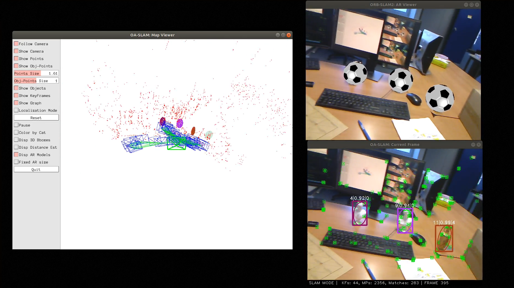
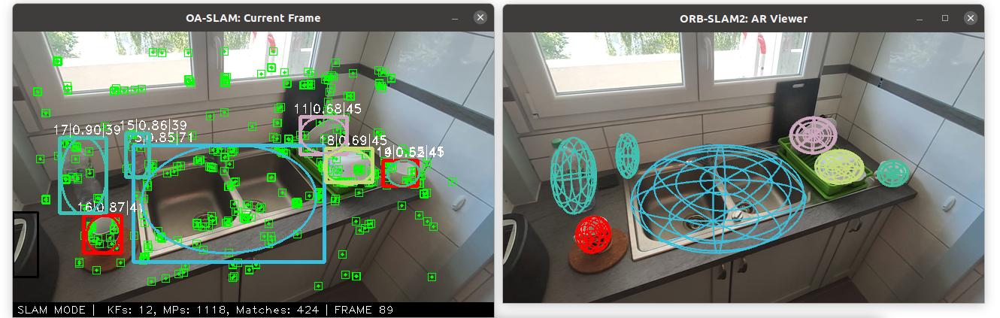

# NOTE: This is a copy of OA-SLAM GitLab repo from https://gitlab.inria.fr/tangram/oa-slam

# ObVi-SLAM Evaluation

This is the repository for ObVi-SLAM Evaluation.

## Set up OA-SLAM
Here's setup guide for OA-SLAM Evaluation. If you encountered any questions during package installation, refer to the original [OA-SLAM README page](#oa-slam).

1. Clone the repo using the `--recursive` flag (Skip this step if you're using the [ObVi-SLAM-Evaluation](https://github.com/ut-amrl/ObVi-SLAM-Evaluation) repo.)
```Bash
git clone --recursive https://github.com/ut-amrl/OA-SLAM.git
git checkout ObViSLAMEvaluation
```

2. You can refer to the original [OA-SLAM README page](#oa-slam) to install dependent packages. Alternatively, you can setup the docker environment and launch the container following instructions [here](https://github.com/ut-amrl/ObVi-SLAM-Evaluation).

3. Compile OA-SLAM:
```Bash
sh build.sh
```
If you encountered any ROS error, double check you set `ROS_PACKAGE_PATH` correctly. Specifically, you should see path to this OA-SLAM repository after you execute:
```Bash
echo $ROS_PACKAGE_PATH
```
If you didn't see the OA-SLAM path under `ROS_PACKAGE_PATH`, you may forgot to `source /.dockerenv`. Alternatively, you can run the following to set the environment variable:
```Bash
export ROS_PACKAGE_PATH=$ROS_PACKAGE_PATH:<path_to_oa_slam_root_dir>
```

## Run Evaluation
First, start roscore (The object detector is depending to ROS; You only need to start it if you want to generate input data for OA-SLAM):
```Bash
roscore
```

We provide convenient scripts to run the evaluation inside the containter:
```Bash
cd /root/ObVi-SLAM-Evaluation/ObVi-SLAM
bash convenience_scripts/docker/oa_slam_data_generator.sh
```


# OA-SLAM

**Associated Publication:**
- **OA-SLAM: Leveraging Objects for Camera Relocalization in Visual SLAM.** Matthieu Zins, Gilles Simon, Marie-Odile Berger, *IEEE International Symposium on Mixed and Augmented Reality (ISMAR 2022).* [Paper](https://arxiv.org/abs/2209.08338) | [Video](https://youtu.be/L1HEL4kLJ3g) | [AR Demo](https://youtu.be/PXG_6LkbtgY)


<p align="center">
<a href="https://youtu.be/PXG_6LkbtgY">  </a>
</p>


<p align="center">

</p>


<p align="center">
<a href="https://youtu.be/L1HEL4kLJ3g">  </a>
</p>


# Installation

## Dependencies

- [Pangolin](https://github.com/stevenlovegrove/Pangolin) for visualization and user interface.
- [OpenCV](http://opencv.org) to manipulate images and features. Version >= 4 is required for live object detection. (tested with 4.6)
- [Eigen3](https://gitlab.com/libeigen/eigen) for linear algebra.
- [Dlib](https://github.com/davisking/dlib) for the Hungarian algorithm.
- [Protocol Buffers](https://github.com/protocolbuffers/protobuf) for Osmap.

Included in the *Thirdparty* folder:
- [DBoW2](https://github.com/dorian3d/DBoW2) for place recognition.
- [g2o](https://github.com/RainerKuemmerle/g2o) for graph-based non-linear optimization.
- [JSON](https://github.com/nlohmann/json) for I/O json files.
- [Osmap](https://github.com/AlejandroSilvestri/osmap) for map saving/loading. Modified version to handle objects.

## Building

Clone the repository recursively:
```
git clone https://gitlab.inria.fr/tangram/oa-slam OA-SLAM --recursive
```

Build OA-SLAM:
```
sh build.sh
```


# Data


Some test sequences are available in the [TUM-RGB dataset](https://vision.in.tum.de/data/datasets/rgbd-dataset).
In particular, we use the *fr2/desk* scene.

Sample data of our custom scenes are available at: [https://dorel.univ-lorraine.fr/dataset.xhtml?persistentId=doi%3A10.12763%2F2CZWJP](https://dorel.univ-lorraine.fr/dataset.xhtml?persistentId=doi%3A10.12763%2F2CZWJP)


Our system takes object detections as input. We provide detections in JSON files for the sample data and for *fr2/desk* in the *Data* folder. They can be obtained from any object detector.
We used an off-the-shelf version of [YOLOv5](https://github.com/ultralytics/yolov5) for our custom scene and a fine-tuned version for *fr2/desk*.

The camera parameters for the sample data are available in *Cameras/MI9T_640x360_0.6.yaml*.
The parameters for *fr2/desk* are in *Cameras/TUM2.yaml*.

# SLAM mode

OA-SLAM includes a map viewer, an image viewer and a AR viewer.

Usage:
```
 ./oa-slam
      vocabulary_file
      camera_file
      path_to_image_sequence (.txt file listing the images or a folder with rgb.txt or 'webcam_id')
      detections_file (.json file with detections or .onnx yolov5 weights)
      categories_to_ignore_file (file containing the categories to ignore (one category_id per line))
      relocalization_mode ('points', 'objects' or 'points+objects')
      output_name  
```


Example to run OA-SLAM on the scene *Table*:

```
./oa-slam ../Vocabulary/ORBvoc.txt ../Cameras/MI9T_640x360_0.6.yaml ../Data/sink_21/frames/ ../Data/detections_yolov5_sink_21.json null points+objects sink
```


Example to run OA-SLAM on the scene *Sink*:

```
./oa-slam ../Vocabulary/ORBvoc.txt ../Cameras/MI9T_640x360_0.6.yaml ../Data/sink_21/frames/ ../Data/detections_yolov5_sink_21.json null points+objects sink
```


Example to run OA-SLAM on the scene *fr2/desk*:
```
./oa-slam ../Vocabulary/ORBvoc.txt ../Cameras/TUM2.yaml ../Data/rgbd_dataset_freiburg2_desk/rgb.txt ../Data/detections_yolov5_tum_rgbd_fr2_desk.json null points+objects fr2
```

## Live mode

It is possible to run OA-SLAM live using a webcam and YOLOv5. Trained weights are available at: [https://dorel.univ-lorraine.fr/dataset.xhtml?persistentId=doi%3A10.12763%2F2CZWJP](https://dorel.univ-lorraine.fr/dataset.xhtml?persistentId=doi%3A10.12763%2F2CZWJP)

These weights are either trained on COCO dataset or fine-tuned on our statutes and museum objects. Models for image size 640 and 320 are available.

```
./oa-slam ../Vocabulary/ORBvoc.txt ../Cameras/TUM2.yaml webcam_X yolov5_weights.onnx ../Data/ignore_statues_parts.txt points+objects output_folder
```

In ```webcam_X``` replace **X** by webcam id. YOLOv5 weights are in ONNX format. You can convert PyTorch weights into ONNX format using the ```export.py``` script in [YOLOv5](https://github.com/ultralytics/yolov5).

In OA-SLAM, YOLOv5 expects images of size 320 x 320. Original size (640 x 640) can be used by modifying ```src/ImageDetections.cc:108```.


# Localization mode


This mode can be used when you have a good map of your working area. In this mode the Point and Object Mapping is deactivated. The system localizes and track the camera in the map, using relocalization if needed.
It is possible to force relocalization on each frame by setting 'force_relocalization_on_each_frame' to 1.

Usage:
```
  ./oa-slam_localization
      vocabulary_file
      camera_file
      path_to_image_sequence (.txt file listing the images or a folder with rgb.txt)
      detections_file (.json file with detections or .onnx yolov5 weights)
      categories_to_ignore_file (file containing the categories to ignore (one category_id per line))
      map_file (.yaml)
      relocalization_mode ('points', 'objects' or 'points+objects')
      output_name 
      force_relocalization_on_each_frame (0 or 1)
```


Example to run OA-SLAM in **Localization** mode on an existing map of the scene *Table* (pre-built from the image sequence *table_6*):

```
./oa-slam_localization ../Vocabulary/ORBvoc.txt ../Cameras/MI9T_640x360_0.6.yaml ../Data/table_9/frames/  ../Data/detections_yolov5_table_9.json null ../Data/table_6_map/map_table.yaml points+objects table_reloc 0
```

Example to run OA-SLAM in **Localization** mode on an existing map of the scene *Sink* (pre-built from the image sequence *sink_13*):
```
./oa-slam_localization ../Vocabulary/ORBvoc.txt ../Cameras/MI9T_640x360_0.6.yaml ../Data/sink_18/frames/  ../Data/detections_yolov5_sink_18.json null ../Data/sink_13_map/map_sink.yaml points+objects sink_reloc 0
```
For both examples, you can check that relocalization fails when only points are used.


# Docker

You can build a docker image containing all you need to run OA-SLAM using ```Dockerfile```.

You may need to adapt the base image (```Dockerfile:1```) depending on your cuda drivers version.


```nvidia-container-toolkit``` is needed:
```
curl -s -L https://nvidia.github.io/nvidia-docker/gpgkey | sudo apt-key add -
curl -s -L https://nvidia.github.io/nvidia-docker/UBUNTU_VERSION/nvidia-docker.list | sudo tee /etc/apt/sources.list.d/nvidia-docker.list

sudo apt-get update && sudo apt-get install -y nvidia-container-toolkit
sudo systemctl restart docker
```

Replace ```UBUNTU_VERSION``` by your version (for example ```ubuntu18.04```).

Build the image:
```
docker build -t oa-slam .
```

Run the docker:
```
sudo xhost +local:root && docker run --gpus all --rm -e DISPLAY=$DISPLAY -v path/to/folder/with/trained_yolov5_in_onnx:/data/ -v /tmp/.X11-unix:/tmp/.X11-unix -v /dev:/dev:ro --device=/dev/video4:/dev/video4 -it oa-slam 
```

Note that you need indicate a folder containing the trained weights for YOLOv5 detector in ONNX format. 
Also, you might have to change the id of the video device.

OA-SLAM executables are built in the folder ```/opt/OA-SLAM/bin```.


# License

OA-SLAM is released under a GPLv3 license. The code is based on [ORB-SLAM2](https://github.com/raulmur/ORB_SLAM2).


